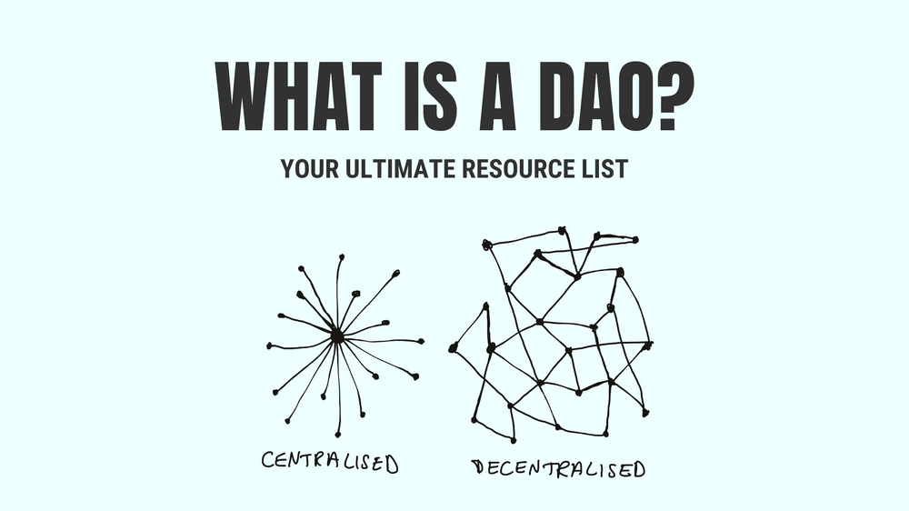
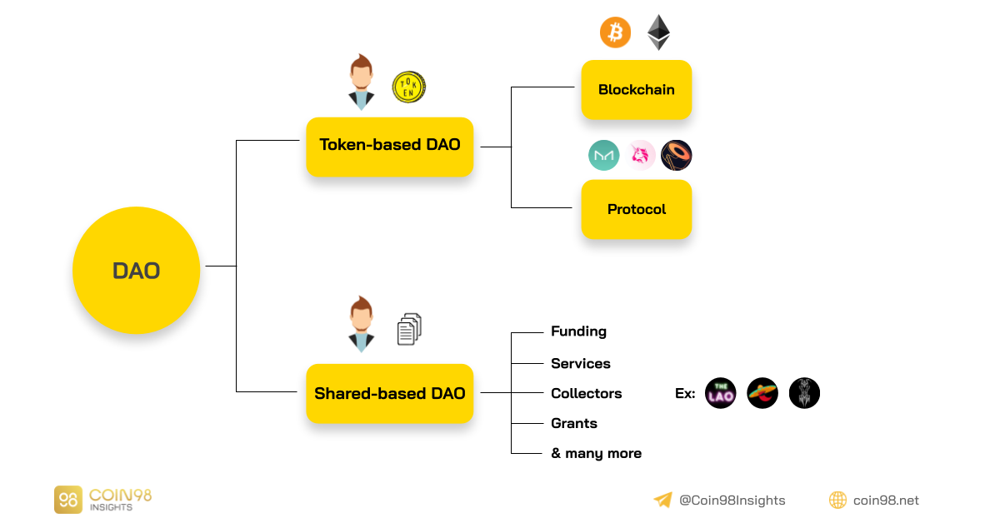
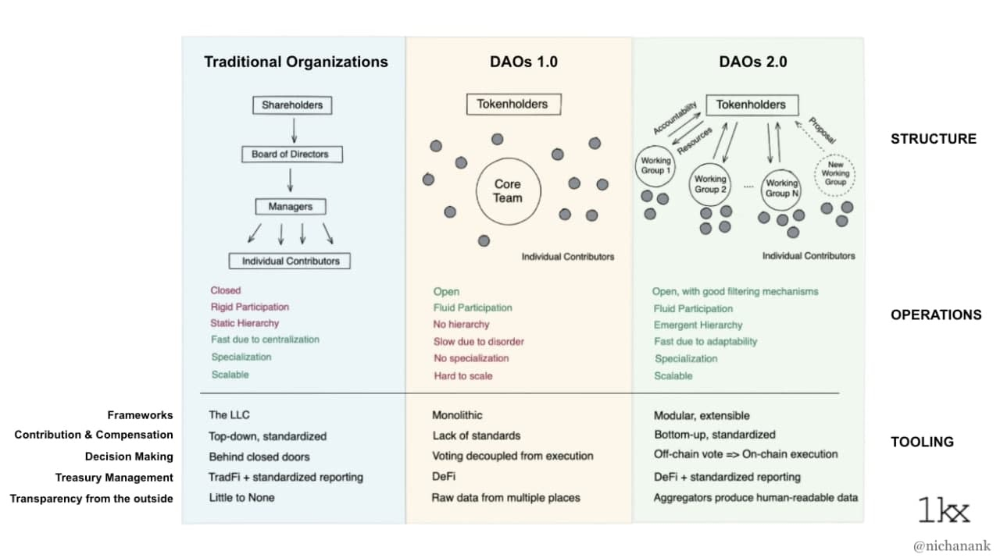

# 1. Blockchain_technologies
Blockchain - All

## 1.1. Table of contents
- [1. Blockchain\_technologies](#1-blockchain_technologies)
  - [1.1. Table of contents](#11-table-of-contents)
  - [1.2. Reference](#12-reference)
  - [1.3. Basic Blockchain Knowledge](#13-basic-blockchain-knowledge)
  - [1.4. Blockchain general knowledge](#14-blockchain-general-knowledge)
  - [1.5. Implementing Your Own Blockchain Using Python](#15-implementing-your-own-blockchain-using-python)
  - [1.6. Oracles](#16-oracles)
  - [1.7. Bitcoin](#17-bitcoin)
  - [1.8. EVM-based Blokchain](#18-evm-based-blokchain)
  - [1.9. Ethereum](#19-ethereum)
  - [1.10. Smart Contracts](#110-smart-contracts)
  - [1.11. Solidity](#111-solidity)
  - [1.12. (Ethereum) Smart Contracts Vulnerability Detection](#112-ethereum-smart-contracts-vulnerability-detection)
    - [1.12.1. Problem](#1121-problem)
    - [1.12.2. Vulnerability of Smart Contract](#1122-vulnerability-of-smart-contract)
    - [1.12.3. Survey](#1123-survey)
    - [1.12.4. Static Vulnerability Detection Methods](#1124-static-vulnerability-detection-methods)
    - [1.12.5. Dynamic Vulnerability Detection Methods](#1125-dynamic-vulnerability-detection-methods)
    - [1.12.6. Machine Learning for Vulnerability Detection](#1126-machine-learning-for-vulnerability-detection)
      - [1.12.6.1. Dataset: Source code - Bytecode](#11261-dataset-source-code---bytecode)
      - [1.12.6.2. Dataset: Simplified and Extract Features](#11262-dataset-simplified-and-extract-features)
    - [1.12.7. ContractWard Models](#1127-contractward-models)
    - [1.12.8. BiLSTM-Attention](#1128-bilstm-attention)
    - [1.12.9. Related Work](#1129-related-work)
    - [1.12.10. Reference](#11210-reference)
  - [1.13. Decentralized Learning for Malware Detection with Blockchain](#113-decentralized-learning-for-malware-detection-with-blockchain)
    - [1.13.1. Problem](#1131-problem)
    - [1.13.2. Mô hình](#1132-mô-hình)
  - [1.14. Smart Contracct security in Blockchain - Workshop](#114-smart-contracct-security-in-blockchain---workshop)
  - [1.15. Tools](#115-tools)
  - [SEC554](#sec554)

---
## 1.2. Reference 

- https://roadmap.sh/blockchain
- https://www.blockchain.education/
- https://docs.google.com/document/d/1in0Gjqu4Uwn50y4bZnnh7IEPW4ZnSRhU-NNRsT5BaRg/edit


:book: Book

- Mastering Bitcoin Programming the Open Blockchain


- The Blockchain Developer by Elad Elrom


- Mastering Ethereum Building Smart Contracts and DApps


- Mastering Blockchain Distributed ledger technology, decentralization, and smart contracts explained (Imran Bashir)


- beginning-ethereum-smart-contracts-programming-with-examples-in-python-solidity-and-javascript 


:book: Paper

<!-- Security Strengths and Weaknesses of Blockchain Smart Contract System: A Survey
Ethereum smart contract security research: survey and future research opportunities
Smart contract security: A software lifecycle perspective
Ethainter: a smart contract security analyzer for composite vulnerabilities
NeuCheck: A more practical Ethereum smart contract security analysis tool
Smart contract: Attacks and protections
Smart contract vulnerability analysis and security audite
Security analysis methods on ethereum smart contract vulnerabilities: a survey
Smart contract privacy protection using AI in cyber-physical systems: tools, techniques and challenges
LedgerHedger: Gas Reservation for Smart-Contract Security
Combining graph neural networks with expert knowledge for smart contract vulnerability detection
Security checklists for Ethereum smart contract development: patterns and best practices
Exploring Security Practices of Smart Contract Developers -->

:book: Youtube

[](https://www.youtube.com/watch?v=yXUMvyr6n3Y)

[](https://www.youtube.com/watch?v=wqbIB_hUbdc)

[](https://www.youtube.com/watch?v=Xb045mCAZHI)

[](https://www.youtube.com/watch?v=9Xx46oKfp7c)

[](https://www.youtube.com/watch?v=rFdcmujyZOQ)

[](https://www.youtube.com/watch?v=eRe1sq4eO3k)


:book: Github

- https://github.com/spo0ds/Journey-to-become-a-Blockchain-Engineer 
- https://github.com/spo0ds/Deep-Dive-into-DEFI


:book: Tools

:book: 

---
## 1.3. Basic Blockchain Knowledge

:pushpin: Outline

- What is Blockchain?

> A digital database or ledger that is distributed among the nodes of peer-to-peer network


- Decentralized - Distributed - Centralized


- Why it matters?

- Blockchain structure
  - Nodes within P2P network
  - Properties of block & genesis block
  - Transactions within the ledger
  - The validation process - mining
  - The “consensus” within a blockchain architecture
    - Proof-of-work
- How blockchain work: Example 


- Basic Blockchain Operations
  - Bitcoin blockchain transactions 
  - Ethereum blockchain transactions
  
  
- Application and uses of Blockchain technology


- DAOs
> DAOS are organizations that live online and live in smart contracts. They're similar to regular organizations in the traditional world, but they have people who may hold governance tokens to make voting decisions or they may do all the governance on-chain on this decentralized settlement layer, giving us the freedom to engage with each other as we please.

 

  

- Token-Based DAO: Token-Based DAO như tên gọi, token chiếm một vai trò quan trọng đối với sự vận hành của DAO. Đây là loại hình phổ biến nhất vì token là mạch máu và đang hiện diện ở mọi nơi trong crypto: 
  - Từ các blockchain như Bitcoin, Ethereum: Miner đảm bảo tính bảo mật cho mạng lưới đổi lại nhận được phần thưởng token.
  - Cho đến các protocol như Maker DAO, Uniswap, Sushiswap…: Token holders có quyền biểu quyết cho các quyết định trong protocol
- Organization (Shared-based DAO): Organization (Shared-based DAO) đại diện cho một nhóm, tổ chức có chung mục tiêu trong một lĩnh vực nào đó, điển hình như các Ventures DAO tập trung vào việc đầu tư. Các thành viên sẽ dùng shares (cổ phần) để biểu quyết hoạt động của tổ chức. 

  


---
## 1.4. Blockchain general knowledge
:pushpin: Outline
- Storage 
- Mining and incentive models
- Decentralization vs trust
- Blockchain forking
- Cryptocurrencies
- Cryptowallets
- Cryptography
- Consensus protocols
- Blockchain interoperability


:bookmark: 

> Unlike a centralized server operated by a single company or organization, decentralized storage systems consist of a peer-to-peer network of user-operators who hold a portion (1 phần) of the overall data (dữ liệu tổng thể), creating a resilient (đụng độ) file storage sharing system.

- Blockchain storage là gì
- Decentralized storage 
- pesistence mechanism/incentive structure
- Data retention enforcement
- Decentrality
- Consensus

- How IPFS works: https://docs.ipfs.tech/
> IPFS is a peer-to-peer (p2p) storage network.


:bookmark: Mining and incentive models

:bookmark: Blokchain forking: xảy ra khi làm thay đổi giao thức hoặc các tập quy tắc cơ bản

- fork, forking ?
- [hard fork](https://www.investopedia.com/terms/h/hard-fork.asp): Hard Fork là thuật ngữ chỉ một blockchain tách ra thành hai chuỗi. 
> Bitcoin Hard Fork đơn giản là sự kiện thay đổi các quy tắc của giao thức Bitcoin khiến cho những khối (block) và giao dịch (transaction) cũ bị vô hiệu hoá. Một khi Hard Fork diễn ra, tất cả các nodes và người dùng bắt buộc phải nâng cấp phần mềm clients bản mới nhất. Trong trường hợp, một số node không chấp nhận quy tắc mới mà vẫn dùng quy tắc cũ thì mạng lưới sẽ xảy ra sự kiện gọi là Split Chain - chia tách chuỗi khối thành hai chuỗi khối khác nhau với tầm nhìn và sứ mệnh khác nhau.
> 


	- https://coin98.net/btc-hardfork-la-gi
	- https://coin98.net/ethereum-hard-fork

:bookmark: Cryptocurrencies
> A cryptocurrency, crypto-currency, or crypto is a digital currency designed to work as a medium of exchange through a blockchain, which is not reliant on any central authority, such as a government or bank, to uphold or maintain it.

- https://www.youtube.com/watch?v=rYQgy8QDEBI

:bookmark: Cryptowallets
> A cryptocurrency wallet is an application that functions as a wallet for your cryptocurrency.


- NFT Wallets

:bookmark: Consensus protocols 
> Thuật toán đồng thuật của blockchain là cơ chế đảm bảo các giao dịch được tạo ra trên blockchain là đúng đắn, trung thực và minh bạch. Về bản chất, blockchain bao gồm nhiều node kết hợp lại tạo ra một mạng lưới. Để một giao dịch được ghi lại trên blockchain, nó phải được đồng ý đồng thời bởi tất cả các node trên mạng lưới.


:bookmark: Blockchain interoperability
> The concept of “blockchain interoperability” refers to the ability of different blockchain networks to exchange and leverage data between one another and to move unique types of digital assets between the networks’ respective blockchains.


---
## 1.5. Implementing Your Own Blockchain Using Python


- Trong mỗi block chứa:
	- Timestamp
	- Index 
	- Hash of the previous block
	- Nonce 
	- Transaction(s)
- Install Flask 

```
pip install flask
pip install requests
```
- Modules and Libraries

```
import sys
import hashlib
import json
from time import time
from uuid import uuid4
from flask import Flask, jsonify, request
import requests
from urllib.parse import urlparse
```

- hash_block():
> encodes một block thành mảng các bytes và hash block đó

- __init__():
> nonce: tìm nonce sao cho hash(block header + nonce + transaction) có kết quả bắt đầu bằng '0000'

- proof_of_work()

- valid_proof()

- append_block():
> Appending the block to the blockchain

- add_transaction()
> amount, recipient, sender

- Synchronizing blokchains
> Trong thực tế thì blockhain network gồm nhiều node lưu giữ các phiên bản blockchain giống nhau. Vì vậy các các node phải được đồng bộ với nhau 

- full source code:

```python
import sys
import hashlib
import json
from time import time
from uuid import uuid4
from flask import Flask, jsonify, request
import requests
from urllib.parse import urlparse

class Blockchain(object):
    difficulty_target = "0000"

    def hash_block(self, block):
        # encode the block into bytes and then hashes it;
        # ensure that the dictionary is sorted, or you'll
        # have inconsistent hashes
        block_encoded = json.dumps(block, sort_keys=True).encode()
        return hashlib.sha256(block_encoded).hexdigest()
    def __init__(self):
        self.nodes = set()
        # stores all the blocks in the entire blockchain
        self.chain = []
        # temporarily stores the transactions for the current
        # block
        self.current_transactions = []
        # create the genesis block with a specific fixed hash
        # of previous block genesis block starts with index 0
        genesis_hash = self.hash_block("genesis_block")
        self.append_block(hash_of_previous_block = genesis_hash, nonce = self.proof_of_work(0, genesis_hash, [])
        )

    # use PoW to find the nonce for the current block
    def proof_of_work(self, index, hash_of_previous_block, transactions):
        # try with nonce = 0
        nonce = 0
        # try hashing the nonce together with the hash of the
        # previous block until it is valid
        while self.valid_proof(index, hash_of_previous_block,transactions, nonce) is False: nonce += 1
        return nonce

    # check if the block's hash meets the difficulty target
    def valid_proof(self, index, hash_of_previous_block, transactions, nonce):
        # create a string containing the hash of the previous
        # block and the block content, including the nonce
        content = f'{index}{hash_of_previous_block}{transactions}{nonce}'.encode()
        # hash using sha256
        content_hash = hashlib.sha256(content).hexdigest()
        # check if the hash meets the difficulty target
        return content_hash[:len(self.difficulty_target)] == self.difficulty_target
    
    # creates a new block and adds it to the blockchain
    def append_block(self, nonce, hash_of_previous_block):
        block = {
            'index': len(self.chain),
            'timestamp': time(),
            'transactions': self.current_transactions,
            'nonce': nonce,
            'hash_of_previous_block': hash_of_previous_block
        }
        # reset the current list of transactions
        self.current_transactions = []
        # add the new block to the blockchain
        self.chain.append(block)
        return block
        
    def add_transaction(self, sender, recipient, amount):
        # adds a new transaction to the current list of
        # transactions
        self.current_transactions.append({
            'amount': amount,
            'recipient': recipient,
            'sender': sender,
        })
        # get the index of the last block in the blockchain
        # and add one to it this will be the block that the
        # current transaction will be added to
        return self.last_block['index'] + 1

    @property
    def last_block(self):
        # returns the last block in the blockchain
        return self.chain[-1]
    # --------------------
    # add a new node to the list of nodes e.g.
    # 'http://192.168.0.5:5000'
    def add_node(self, address):
        parsed_url = urlparse(address)
        self.nodes.add(parsed_url.netloc)
        print(parsed_url.netloc)
    # determine if a given blockchain is valid
    def valid_chain(self, chain):
        last_block = chain[0] # the genesis block
        current_index = 1 # starts with the second block
        while current_index < len(chain):
            # get the current block
            block = chain[current_index]
            # check that the hash of the previous block is
            # correct by hashing the previous block and then
            # comparing it with the one recorded in the
            # current block
            if block['hash_of_previous_block'] != self.hash_block(last_block):
                return False
            # check that the nonce is correct by hashing the
            # hash of the previous block together with the
            # nonce and see if it matches the target
            if not self.valid_proof(current_index, block['hash_of_previous_block'], block['transactions'], block['nonce']):
                return False
            # move on to the next block on the chain
            last_block = block
            current_index += 1

        # the chain is valid
        return True


    def update_blockchain(self):
        # get the nodes around us that has been registered
        neighbours = self.nodes
        new_chain = None

        # for simplicity, look for chains longer than ours
        max_length = len(self.chain)

        # grab and verify the chains from all the nodes in our network
        for node in neighbours:            
            # get the blockchain from the other nodes
            response = requests.get(f'http://{node}/blockchain')

            if response.status_code == 200:
                length = response.json()['length']
                chain = response.json()['chain']

                # check if the length is longer and the chain is valid
                if length > max_length and self.valid_chain(chain):
                    max_length = length
                    new_chain = chain

        # replace our chain if we discovered a new, valid chain longer than 
        # ours
        if new_chain:
            self.chain = new_chain
            return True

        return False
    # --------------------


app = Flask(__name__)

# generate a globally unique address for this node
node_identifier = str(uuid4()).replace('-', '')

# instantiate the Blockchain
blockchain = Blockchain()


# return the entire blockchain
@app.route('/blockchain', methods=['GET'])
def full_chain():    
    response = {
        'chain': blockchain.chain,
        'length': len(blockchain.chain),
    }
    return jsonify(response), 200

@app.route('/mine', methods=['GET'])
def mine_block():
    blockchain.add_transaction(
        sender="0",
        recipient=node_identifier,
        amount=1,
    )
    # obtain the hash of last block in the blockchain
    last_block_hash = blockchain.hash_block(blockchain.last_block)
    # using PoW, get the nonce for the new block to be added
    # to the blockchain
    index = len(blockchain.chain)
    nonce = blockchain.proof_of_work(index, last_block_hash, blockchain.current_transactions)
    # add the new block to the blockchain using the last block
    # hash and the current nonce
    block = blockchain.append_block(nonce, last_block_hash)
    response = {
        'message': "New Block Mined",
        'index': block['index'],
        'hash_of_previous_block': block['hash_of_previous_block'],
        'nonce': block['nonce'],
        'transactions': block['transactions'],
    }
    return jsonify(response), 200

@app.route('/transactions/new', methods=['POST'])
def new_transaction():
    # get the value passed in from the client
    values = request.get_json()
    # check that the required fields are in the POST'ed data
    required_fields = ['sender', 'recipient', 'amount']
    if not all(k in values for k in required_fields):
        return ('Missing fields', 400)
    # create a new transaction
    index = blockchain.add_transaction(
        values['sender'],
        values['recipient'],
        values['amount']
    )
    response = {'message': f'Transaction will be added to Block {index}'}
    return (jsonify(response), 201)

@app.route('/nodes/add_nodes', methods=['POST'])
def add_nodes():
    # get the nodes passed in from the client
    values = request.get_json()
    nodes = values.get('nodes')
    if nodes is None:
        return "Error: Missing node(s) info", 400
    for node in nodes:
        blockchain.add_node(node)
    response = {
    'message': 'New nodes added',
    'nodes': list(blockchain.nodes),
    }
    return jsonify(response), 201

@app.route('/nodes/sync', methods=['GET'])
def sync():
    updated = blockchain.update_blockchain()
    if updated:
        response = {
        'message': 'The blockchain has been updated to the latest',
        'blockchain': blockchain.chain
        }
    else:
        response = {
        'message': 'Our blockchain is the latest',
        'blockchain': blockchain.chain
        }
    return jsonify(response), 200

if __name__ == '__main__':
    app.run(host='0.0.0.0', port=int(sys.argv[1]))
```

---
## 1.6. Oracles 

:pushpin: Outline
- Hybrid Smart Contracts
- Chainlink
- Oracle Networks

:bookmark: [What Is a Blockchain Oracle?](https://chain.link/education/blockchain-oracles)
- Blockchain oracle: là một third-party service cho phép smart contracts kết nối với thế giới bên ngoài
- Có các layer: queries, verifies, authenticates 


:bookmark: Hybrid Smart Contracts 


---
## 1.7. Bitcoin
? Bitcoin was one of the first protocols to use this revolutionary technology called "blockchain". Satoshi Nakamoto released Bitcoin's white paper, and it outlined how bitcoin can be used to make peer-to-peer transactions in a decentralized network. This network is powered by cryptography. It allows people to engage in censorship-resistant finance in a decentralized manner. Because of some of bitcoin's characteristics, many people regard it as a superior store of value to other assets such as gold.That's why it is commonly referred to as "digital gold." Similar to gold, there's a scarce and set amount of it on the planet, and people use it to buy and sell, similar to other assets. You can read more about the original vision in the [white paper] (https://bitcoinwhitepaper.co/).

---
## 1.8. EVM-based Blokchain


---
## 1.9. Ethereum

---
## 1.10. Smart Contracts 


---
## 1.11. Solidity

:bookmark: Reference 

:bookmark: Roadmap


- Solidity 
- Install the Solidity Compiler
- Layout of a Solidity Source File 
- Sutucture of a Contract 
- Types
- Units and Globally Available Variables 
- Expressions and Control Structures 
- Contracts 
- Inline Asssembly 
- Cheatsheet
- Language Grammar 
- Using the Compiler 
- Analysis the Compiler Output
- Solidity IR-bassed Coddegen Changes 
- Layout of State Variables in Storage
- Layout in Memory 
- Layout of Call data
- Cleaning Up Variables 
_ Source Mappings 
- The Optimizer 
- Contract Metadata 
- Contract ABI Specification


---
## 1.12. (Ethereum) Smart Contracts Vulnerability Detection

### 1.12.1. Problem

- The DAO attacks
- The Parity bug


### 1.12.2. Vulnerability of Smart Contract

:book: Reentrancy

:book: Arithmetic (Integer Overflow and Underflow)

:book: Denial of Service

:book: Locked Ether

:book: Time Manipulation (Block values as a proxy for time)

:book: Timestamp Ordering (Transaction Order Dependence)

:book: Authorization through tx.origin

:book: Unhandled Exception (Unchecked Call Return Value)

:book: Access Control

:book: Bad Randomness

:book: Front-Running

:book: Short Address Attack

:book: Unknown Unknowns


### 1.12.3. Survey

- [ ] Systematic Review of Security Vulnerabilities in Ethereum Blockchain Smart Contract
- [ ] The State of Ethereum Smart Contracts Security: Vulnerabilities, Countermeasures, and Tool Support
- [ ] Survey on Blockchain based Smart Contracts: Technical Aspects and Future Research

### 1.12.4. Static Vulnerability Detection Methods

:book: Information Flow Analysis-based

:book: Symbolic Execution-based

:book: Logic Rules-based

:book: Composite Methods-based


### 1.12.5. Dynamic Vulnerability Detection Methods

:book: Fuzzing-based

:book: Validation-based

### 1.12.6. Machine Learning for Vulnerability Detection

#### 1.12.6.1. Dataset: Source code - Bytecode

- GoogleBig Query
- Verified Source code in EtherScan.io

#### 1.12.6.2. Dataset: Simplified and Extract Features

- N-grams

- Graph

- vectorized smart contract snippet 

### 1.12.7. ContractWard Models

- Reference:
  - [ContractWard: Automated Vulnerability Detection Models for Ethereum Smart Contracts](https://ieeexplore.ieee.org/document/8967006)
  - 

### 1.12.8. BiLSTM-Attention

- Reference:
  - [Towards Automated Reentrancy Detection for Smart Contracts Based on Sequential Models](https://ieeexplore.ieee.org/document/8970384)


### 1.12.9. Related Work 


| Model | Method | Capability | Technology | Input | Output | Dataset | evaluate |
|---| ----| ---| ------| ----| ---| ---| -----|
|MANDO | Learning heterogeneous graphs | | | source code | 493 | 90.51%|

### 1.12.10. Reference 


---
## 1.13. Decentralized Learning for Malware Detection with Blockchain

- [ ] Collective Intelligence: Decentralized Learning for Android Malware Detection in IoT with Blockchain
- [ ] Record and Reward Federated Learning Contributions with Blockchain
- [ ] https://github.com/sreyafrancis/BlockchainForFederatedLearning


### 1.13.1. Problem
Ngữ cảnh:
- Nhiều dữ liệu với hình thức khác nhau (mạng xh, mẫu mua hàng, hồ sơ chăm sóc sức khoẻ,..) của người dùng bị thu thập và sử dụng phân tích dữ liệu cho ML
- Cho đi nguồn dữ liệu mà không có phần thưởng
- Tổ chức có toàn quyền truy cập vào dữ liệu đó vào đó -> có thể là hành vi xâm nhập quyền riêng tư

sử dụng Federated Learning: phương pháp giảm thiểu vấn đề quyền sở hữu và quyền riêng tư
- gửi training model cho người dùng để đào tạo trên dữ liệu cục bộ của họ
- người dùng gửi lại weights để cập nhật mô hình
-> Người dùng không bao giờ tiết lộ dữ liệu cá nhân cho chủ sở hữu
sử dụng Blockchain: - để tạo điều kiện thuận lợi cho việc tải lên (uploading) và theo dõi các bản cập nhật từ người dùng và thưởng cho người dùng dữ liệu mà họ đã sử dụng trong tính toán 
			  - hiển thị các bản cập nhật không thể thay đổi nên an toàn
-> kết hợp quyền riêng tư và bảo mật dữ liệu cùng với phần thưởng cho các video tải lên khiến hệ thống trở nên phổ biến, thu thập được nhiều dữ liệu hơn
sử dụng EOS blockchain và IPFS để ghi lại các bản cập nhật đã tải lên và thưởng cho người dùng dựa trên chi phí đào tạo
đề xuất sơ đồ CSVES để chỉ xác thực và thưởng cho các bản cập nhật được tải lên có giá trị thông qua SC
Triển khai đơn giản với Python và Hyperledger Fabric để xác minh tính khả dụng của hệ thóng

Các model hiện có:
BlockFL sử dụng blockchain, thưởng cho người dùng cho các bản cập nhật cục bộ tỷ lệ thuận với số lượng điểm cục bộ (local data points) 
DeepChain đề xuất 1 cơ chế blockchain dựa trên khuyến khích để thưởng /trừng phạt cho người tham gia trung thực/không trung thực
-> Không đúng với thực tế
....
=> Hạn chế của các model trên là không chính xác hoặc không hiệu quả trong việc thưởng cho những đóng góp của người dùng và thiếu khả năng mở rộng dữ liệu trên blockchain


EOS blockchain: - một public blockchain không có phí giao dịch -> khuyến khích người dùng sử dụng
		    - sử dụng set 21 producers để tạo các block đồng thời, tạo blockchain có khả năng mở rộng có thể xử lý hàng triệu giao dịch mỗi giây
	
Hạn chế của người dùng thông qua SC:
- Ngay cả khi chỉ tải gradient lên thì chủ sở hữu O hoặc bên khác vẫn có thể suy ra dữ liệu của người dùng
- mặc dù sử dụng public blockchain nhưng toàn bộ gradients và training model đều không có trên blockchain -> ẩn (hidden)
- Quyền riêng tu của mô hình đào tạo đạt được thông qua sử dụng Paullier's Cryptosystem - một sơ đồ mã hoá homomorphic được sử dụng trong học máy phân tán
- Quyền riêng tư của gradient đặt được bằng cách tải toàn bộ gradient lên off-chain trên IPFS mà chỉ O mới có thể truy cập được

Proof of Concept: tìm cách trả lời liệu một blockchain có thể hoạt động với triển khai FL trong Python để ghi lại và thưởng cho các record and reward gradients uploads hay không

### 1.13.2. Mô hình


- System and Blockchain Architecture
- Global Model
- Smart Contracts
- System Design and Workflow
- Data Validity and Quality
- Restrictions on Users via Smart Contracts
- PROOF OF CONCEPT

:pushpin: Reppositories Project 

---
##  1.14. Smart Contracct security in Blockchain - Workshop 

- Anh Trần Ngọc Tín và Nguyễn Minh Quang, BK HCM
- Verichains 
  - https://www.verichains.io/publications
- Solidity basic
- Common vulnerabilies
- https://blog.verichains.io/
- https://github.com/verichains/public-audit-reports
- https://www.verichains.io/
- https://www.linkedin.com/company/verichains/


- https://cystack.net/blog
- https://github.com/cystack/security-audit-reports/tree/main/smart-contracts
- 


---
## 1.15. Tools

| Name                                   | Github link                                           | Describe |
| -------------------------------------- | ----------------------------------------------------- | -------- |
| Solidity Parser                        | https://github.com/ConsenSysMesh/solidity-parser      |          |
| solidity-parser-antlr                  | https://github.com/federicobond/solidity-parser-antlr |          |
| python-solidity-parser                 | https://github.com/ConsenSys/python-solidity-parser   |          |
| solc-select                            | https://github.com/crytic/solc-select                 |          |
| py-solc                                | https://github.com/ethereum/py-solc                   |          |
| etherscan-python                       | https://github.com/pcko1/etherscan-python             |          |
| py-solc-x                              | https://github.com/iamdefinitelyahuman/py-solc-x      |          |
| SmartCheck                             |                                                       |          |
| MAIAN                                  |                                                       |          |
| ReGuard                                |                                                       |          |
| ContractFuzzer                         |                                                       |          |
| Oyente                                 |                                                       |          |
| S-gram                                 |                                                       |          |
| Vandal                                 |                                                       |          |
| Prosity                                |                                                       |          |
| MadMax                                 |                                                       |          |
| Ethereum Eclipse Attacks and Solutions |                                                       |          |
| Securify                               |                                                       |          |
| Semantic analysis framework            |                                                       |          |
| TrustChain                             |                                                       |          |
| Zeus                                   |                                                       |          |
| EtherTrust                             |                                                       |          |
| MaintiCore                             | https://github.com/trailofbits/manticore              |          |


## SEC554

